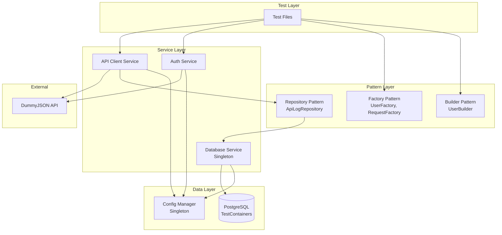
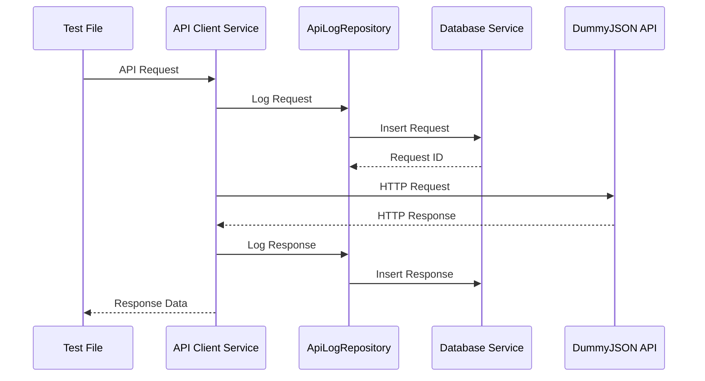

# API Test Automation Framework

TypeScript ve Playwright kullanılarak geliştirilmiş kapsamlı bir API test otomasyon framework'ü. DummyJSON API'si için CRUD operasyonları, authentication ve array response validasyonu testlerini içerir.

## 📑 İçindekiler

- [Test İstatistikleri](#-test-istatistikleri)
- [Özellikler](#özellikler)
- [Proje Yapısı](#proje-yapısı)
- [Architecture](#architecture)
- [Design Patterns](#design-patterns)
- [Kurulum](#kurulum)
- [Konfigürasyon](#konfigürasyon)
- [Database Schema](#database-schema)
- [Test Execution](#test-execution)
- [Test Senaryoları](#test-senaryoları)
- [API Endpoints Tested](#api-endpoints-tested)
- [Hızlı Referans](#hızlı-referans)
- [Teknik Detaylar](#teknik-detaylar)
- [Troubleshooting](#troubleshooting)
- [Dependencies](#dependencies)

## 📊 Test İstatistikleri

- **Toplam Test:** 53 test
- **Smoke Tests:** 4 kritik test
- **Regression Tests:** 53 test (tümü)
- **Test Durumu:** ✅ Tüm testler başarıyla geçiyor
- **Test Coverage:** User CRUD, Authentication, Array Response Validation, Negative Scenarios
- **Test Dosyaları:**
  - `user-crud.spec.ts`: 13 test
  - `user-negative.spec.ts`: 16 test
  - `auth.spec.ts`: 13 test
  - `array-response.spec.ts`: 11 test

## Özellikler

- ✅ **TypeScript + Playwright** - Modern test framework
- ✅ **Design Patterns** - Singleton, Factory, Builder, Repository pattern'leri
- ✅ **TestContainers Integration** - PostgreSQL container yönetimi (otomatik başlatma/durdurma)
- ✅ **Auto Schema/Table Creation** - Otomatik veritabanı şema ve tablo oluşturma
- ✅ **Config Management** - Property dosyası + Environment variable override
- ✅ **Request/Response Logging** - Tüm API istekleri ve yanıtları veritabanına kaydedilir
- ✅ **Test Grouping** - @smoke ve @regression annotation'ları ile test gruplama
- ✅ **Comprehensive Test Coverage** - CRUD, negative test senaryoları ve validasyon testleri
- ✅ **Custom Playwright Fixtures** - Worker-scoped database management
- ✅ **Type Safety** - Full TypeScript type definitions

## Proje Yapısı

```
ThyApiCase/
├── src/
│   ├── config/              # Configuration management (Singleton)
│   │   ├── config.ts
│   │   └── database.config.ts
│   ├── models/              # Data models
│   │   ├── user.model.ts
│   │   └── api-response.model.ts
│   ├── services/            # Business logic services
│   │   ├── api-client.service.ts
│   │   ├── database.service.ts (Singleton)
│   │   └── auth.service.ts
│   ├── factories/           # Factory pattern implementations
│   │   ├── user.factory.ts
│   │   └── request.factory.ts
│   ├── builders/            # Builder pattern implementations
│   │   └── user.builder.ts
│   ├── repositories/        # Repository pattern
│   │   └── api-log.repository.ts
│   ├── fixtures/            # Custom Playwright fixtures
│   │   └── test.fixture.ts
│   ├── utils/               # Utility functions
│   │   ├── database.util.ts
│   │   ├── validation.util.ts
│   │   ├── global-setup.ts
│   │   └── global-teardown.ts
│   └── types/               # TypeScript type definitions
│       └── index.ts
├── tests/
│   ├── user/
│   │   ├── user-crud.spec.ts
│   │   └── user-negative.spec.ts
│   ├── auth/
│   │   └── auth.spec.ts
│   └── array-response/
│       └── array-response.spec.ts
├── config/
│   └── application.properties
├── package.json
├── tsconfig.json
├── playwright.config.ts
└── README.md
```

## Architecture

### System Architecture Diagram



### Request Flow Diagram



## Design Patterns

### 1. Singleton Pattern

**Kullanım Alanları:**
- `Config` class - Tek bir configuration instance'ı
- `DatabaseService` class - Tek bir database connection instance'ı

**Avantajları:**
- Memory efficiency
- Global state management
- Single source of truth

**Örnek Kullanım:**
```typescript
const config = Config.getInstance();
const dbService = DatabaseService.getInstance();
```

### 2. Factory Pattern

**Kullanım Alanları:**
- `UserFactory` - Test user data generation
- `RequestFactory` - API request object creation

**Avantajları:**
- Object creation logic encapsulation
- Flexible test data generation
- Code reusability

**Örnek Kullanım:**
```typescript
const user = UserFactory.createRandomUser();
const request = RequestFactory.createPostRequest('/users/add', user);
```

### 3. Builder Pattern

**Kullanım Alanları:**
- `UserBuilder` - Fluent interface ile user object construction

**Avantajları:**
- Readable object construction
- Optional parameter handling
- Immutable object creation

**Örnek Kullanım:**
```typescript
const user = new UserBuilder()
  .withFirstName('John')
  .withLastName('Doe')
  .withEmail('john@example.com')
  .withAge(30)
  .buildMinimal();
```

### 4. Repository Pattern

**Kullanım Alanları:**
- `ApiLogRepository` - Database operations abstraction

**Avantajları:**
- Data access layer separation
- Easy to mock for testing
- Centralized database operations

**Örnek Kullanım:**
```typescript
const repository = new ApiLogRepository();
const requestId = await repository.logRequest(request);
await repository.logResponse(response);
```

## Kurulum

### Gereksinimler

- Node.js (v18 veya üzeri)
- npm veya yarn
- Docker (TestContainers için) - Docker Desktop veya Docker Engine çalışır durumda olmalı

### Adımlar

1. **Projeyi klonlayın:**
```bash
git clone https://github.com/muhammetemredurmus/ThyApiTestProject.git
cd ThyApiCase
```

2. **Dependencies'leri yükleyin:**
```bash
npm install
```

3. **Playwright browser'ları yükleyin:**
```bash
npx playwright install
```

4. **Docker'ın çalıştığını doğrulayın:**
```bash
docker ps
```

> **Not:** TestContainers otomatik olarak PostgreSQL container'ını başlatacak ve testler tamamlandığında temizleyecektir. Manuel olarak bir şey yapmanıza gerek yoktur.

## Konfigürasyon

### Application Properties

`config/application.properties` dosyasından temel konfigürasyon yapılabilir:

```properties
# Database Configuration
db.host=localhost
db.port=5432
db.name=testdb
db.user=testuser
db.password=testpass

# API Configuration
api.base.url=https://dummyjson.com
api.username=emilys
api.password=emilyspass
```

### Environment Variables

Pipeline için environment variable'lar ile override edilebilir:

**Linux/Mac:**
```bash
export DB_HOST=localhost
export DB_PORT=5432
export DB_NAME=testdb
export DB_USER=testuser
export DB_PASSWORD=testpass
```

**Windows (PowerShell):**
```powershell
$env:DB_HOST="localhost"
$env:DB_PORT="5432"
$env:DB_NAME="testdb"
$env:DB_USER="testuser"
$env:DB_PASSWORD="testpass"
```

**Windows (CMD):**
```cmd
set DB_HOST=localhost
set DB_PORT=5432
set DB_NAME=testdb
set DB_USER=testuser
set DB_PASSWORD=testpass
```

> **Not:** Environment variable'lar property dosyasındaki değerleri override eder. TestContainers kullanıldığında, database konfigürasyonu otomatik olarak container'dan alınır ve bu değerler kullanılır.

## Database Schema

Framework otomatik olarak şema ve tabloları oluşturur:

### Schema: `api_test`

#### Table: `api_requests`
- `id` (SERIAL PRIMARY KEY)
- `endpoint` (VARCHAR(500))
- `method` (VARCHAR(10))
- `headers` (JSONB)
- `body` (JSONB)
- `timestamp` (TIMESTAMP)

#### Table: `api_responses`
- `id` (SERIAL PRIMARY KEY)
- `request_id` (INTEGER, FK to api_requests)
- `status_code` (INTEGER)
- `headers` (JSONB)
- `body` (JSONB)
- `response_time_ms` (INTEGER)
- `timestamp` (TIMESTAMP)

## Test Execution

### Hızlı Başlangıç

```bash
# Tüm testleri çalıştır
npm test

# Sadece smoke testleri çalıştır (hızlı doğrulama)
npm run test:smoke

# Test sonuçlarını HTML raporunda görüntüle
npm run report
```

### Tüm Testleri Çalıştırma

```bash
npm test
# veya
npx playwright test
```

### Smoke Testleri

```bash
npm run test:smoke
# veya
npx playwright test --grep @smoke
```

### Regression Testleri

```bash
npm run test:regression
# veya
npx playwright test --grep @regression
```

### UI Mode (İnteraktif Test Çalıştırma)

```bash
npm run test:ui
# veya
npx playwright test --ui
```

> **Not:** UI mode'da testleri interaktif olarak çalıştırabilir, debug edebilir ve sonuçları gerçek zamanlı görebilirsiniz.

### Headed Mode (Browser Görünür)

```bash
npm run test:headed
# veya
npx playwright test --headed
```

### HTML Report

```bash
npm run report
# veya
npx playwright show-report
```

> **Not:** Test çalıştırmalarından sonra `playwright-report/index.html` dosyası oluşturulur. Bu raporu tarayıcıda açarak detaylı test sonuçlarını, log'ları ve ekran görüntülerini görüntüleyebilirsiniz.

## Test Senaryoları

### User CRUD Tests

- ✅ User listeleme (pagination ile)
- ✅ Tekil kullanıcı sorgulama
- ✅ Kullanıcı oluşturma
- ✅ Kullanıcı güncelleme (PUT ve PATCH)
- ✅ Kullanıcı silme (DELETE)

### User Negative Tests

- ✅ Invalid user ID ile sorgulama
- ✅ Eksik required field'lar ile user creation
- ✅ Invalid data types ile user creation
- ✅ Non-existent user update/delete
- ✅ Edge case senaryoları

### Authentication Tests

- ✅ Login flow validasyonu (accessToken ve refreshToken)
- ✅ Token validation ve management
- ✅ Invalid credentials scenarios
- ✅ Token header generation
- ✅ Multiple login attempts handling

### Array Response Tests

- ✅ GET /users array response validation
- ✅ Belirli bir user'ı array'den çekme ve doğrulama
- ✅ Pagination ile array response validation

## Test Grupları

### @smoke
Kritik API testleri - Hızlı smoke test suite'i için:
- User listeleme
- Tekil kullanıcı sorgulama
- Kullanıcı oluşturma
- Login flow

### @regression
Tüm testler - Kapsamlı regression test suite'i için:
- Tüm CRUD operasyonları
- Negative test senaryoları
- Authentication testleri
- Array response validasyonları

## API Endpoints Tested

Base URL: `https://dummyjson.com`

### User Endpoints
- `GET /users` - User listesi (pagination)
- `GET /users/:id` - Tekil kullanıcı
- `POST /users/add` - Yeni kullanıcı oluşturma
- `PUT /users/:id` - Kullanıcı güncelleme (full update)
- `PATCH /users/:id` - Kullanıcı güncelleme (partial update)
- `DELETE /users/:id` - Kullanıcı silme

### Authentication Endpoints
- `POST /auth/login` - Login (returns `accessToken` ve `refreshToken`)

## Test Execution Örnekleri

### Başarılı Test Çıktısı

```bash
$ npm test

Running 53 tests using 11 workers

  ok  1 [api-tests] › tests\array-response\array-response.spec.ts:6:7 › Array Response Validation › @regression
  ok  2 [api-tests] › tests\user\user-crud.spec.ts:8:7 › User CRUD Operations › @smoke @regression
  ...
  
  53 passed (16.6s)
```

### Smoke Test Çıktısı

```bash
$ npm run test:smoke

Running 4 tests using 4 workers

  ok  1 [api-tests] › tests\auth\auth.spec.ts:5:7 › Authentication & Authorization › @smoke @regression
  ok  2 [api-tests] › tests\user\user-crud.spec.ts:8:7 › User CRUD Operations › @smoke @regression
  ...
  
  4 passed (8.7s)
```

## Troubleshooting

### TestContainers Issues

Eğer TestContainers PostgreSQL container'ı başlatamazsa:

1. **Docker'ın çalıştığından emin olun:**
   ```bash
   docker ps
   ```

2. **Docker Desktop'ın başlatıldığından emin olun** (Windows/Mac)

3. **Docker permissions'ları kontrol edin** (Linux)

4. **TestContainers log'larını kontrol edin:**
   - Console output'ta "Starting PostgreSQL container with TestContainers..." mesajını görmelisiniz
   - "PostgreSQL container started successfully" mesajı görünmelidir

### Database Connection Issues

Eğer database bağlantısı başarısız olursa:

1. `config/application.properties` dosyasını kontrol edin
2. Environment variable'ları kontrol edin:
   ```bash
   echo $DB_HOST
   echo $DB_PORT
   ```
3. TestContainers log'larını kontrol edin
4. TestContainers'ın container'ı başarıyla oluşturduğundan emin olun

### API Request Failures

Eğer API istekleri başarısız olursa:

1. Internet bağlantısını kontrol edin
2. DummyJSON API'nin erişilebilir olduğunu kontrol edin:
   ```bash
   curl https://dummyjson.com/users/1
   ```
3. Rate limiting olup olmadığını kontrol edin
4. API response'larını test log'larında kontrol edin

### TypeScript Compilation Errors

Eğer TypeScript derleme hataları alırsanız:

1. `tsconfig.json` dosyasını kontrol edin
2. Dependencies'lerin yüklü olduğundan emin olun:
   ```bash
   npm install
   ```
3. Type definitions'ların mevcut olduğundan emin olun:
   ```bash
   npm run build
   ```

## Hızlı Referans

### Test Çalıştırma Komutları

| Komut | Açıklama |
|-------|----------|
| `npm test` | Tüm testleri çalıştır |
| `npm run test:smoke` | Sadece smoke testleri çalıştır |
| `npm run test:regression` | Tüm regression testleri çalıştır |
| `npm run test:ui` | İnteraktif UI mode'da test çalıştır |
| `npm run test:headed` | Browser görünür modda test çalıştır |
| `npm run report` | HTML test raporunu görüntüle |
| `npm run build` | TypeScript kodunu derle |

### Test Annotation'ları

- `@smoke`: Kritik testler - Hızlı doğrulama için
- `@regression`: Tüm testler - Kapsamlı test suite'i için

### Test Fixtures

- `apiClient`: Database logging olmadan API client
- `apiClientWithDb`: Database logging ile API client (önerilen)
- `authService`: Authentication işlemleri için service
- `dbService`: Database işlemleri için service (worker-scoped)

## Teknik Detaylar

### Authentication Token Yönetimi

Framework, DummyJSON API'nin döndürdüğü `accessToken` ve `refreshToken` değerlerini yönetir:

```typescript
// Login response
{
  "id": 1,
  "username": "emilys",
  "email": "emily@example.com",
  "accessToken": "eyJhbGciOiJIUzI1NiIsInR5cCI6IkpXVCJ9...",
  "refreshToken": "eyJhbGciOiJIUzI1NiIsInR5cCI6IkpXVCJ9..."
}
```

### Database Logging

Tüm API istekleri ve yanıtları otomatik olarak PostgreSQL'e kaydedilir:

- **Request Logging:** Endpoint, method, headers, body
- **Response Logging:** Status code, headers, body, response time
- **Relationship:** Response'lar request'lerle foreign key ile ilişkilendirilir

### Test Fixtures

Framework, Playwright custom fixtures kullanarak test lifecycle'ını yönetir:

- **`apiClient`**: DB logging olmadan API client
- **`apiClientWithDb`**: DB logging ile API client
- **`authService`**: Authentication service
- **`dbService`**: Worker-scoped database service (TestContainers yönetimi)

### Kod Kalitesi

- ✅ **TypeScript Strict Mode**: Tüm type checking aktif
- ✅ **No Linter Errors**: ESLint/TSLint hatası yok
- ✅ **DRY Principle**: Kod tekrarı yok
- ✅ **SOLID Principles**: Design pattern'ler ile uyumlu
- ✅ **Error Handling**: Comprehensive error handling

## Dependencies

### Production Dependencies
- `@playwright/test`: ^1.40.0
- `pg`: ^8.11.3 (PostgreSQL client)
- `testcontainers`: ^10.7.0
- `@testcontainers/postgresql`: ^10.7.0
- `dotenv`: ^16.3.1

### Development Dependencies
- `typescript`: ^5.3.3
- `@types/node`: ^20.10.0
- `@types/pg`: ^8.10.9

## Versiyon Bilgisi

- **Framework Version:** 1.0.0
- **Node.js:** v18+ (önerilen)
- **TypeScript:** 5.3.3
- **Playwright:** 1.40.0
- **PostgreSQL:** 15-alpine (TestContainers)

## Contributing

1. Fork the repository
2. Create a feature branch (`git checkout -b feature/amazing-feature`)
3. Make your changes
4. Write/update tests
5. Ensure all tests pass (`npm test`)
6. Commit your changes (`git commit -m 'Add amazing feature'`)
7. Push to the branch (`git push origin feature/amazing-feature`)
8. Submit a pull request

## License

ISC

## Authors

Muhammet Emre Durmuş QA Engineer - API Automation Case Study

---

**Test Durumu:** ✅ 53/53 tests passing
**Production Ready:** ✅ Yes

